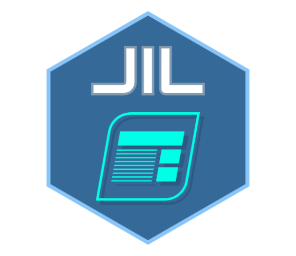

# JIL - HTML5 Game UI

[](https://app.codacy.com/app/kefniark/jil?utm_source=github.com&utm_medium=referral&utm_content=kefniark/jil&utm_campaign=Badge_Grade_Dashboard)
[](https://travis-ci.org/kefniark/jil)
[](https://npmjs.org/package/jil)
[](https://npmjs.org/package/jil)
[](https://npmjs.org/package/jil)

* [**Demo**](https://kefniark.github.io/jil/dist/samples/)
* [**API Doc**](https://kefniark.github.io/jil/dist/docs/)



## **UI Framework for HTML5 Games**:
 * Autoscale and centering
 * Vector positioning (`pivot`, `anchor`, `position`, `scale`, `rotation`)
 * Fast HTML5/CSS3 (Use CSS3 transform & Virtual dom)
 * Tween integration (Provide an easy way to write animation)
 * Layer system make it easy to organize UI
 * Engine agnostic (Work with HTML canvas and dont interfer with 2D/3D Engine):
   - Babylon.js
   - Pixi
   - Phaser
   - Three.js
   - ...

> This is still a project in **early development**
>
> I plan later, to make a small editor to design scene UI and export them in `*.json`

---

## Usage

This library is exported with `UMD (Universal Module Definition)`:

### CDN
You can use directly in your webpage `https://cdn.jsdelivr.net/npm/jil@latest/dist/jil.min.js`

and call ```jil.SceneManager.init()```

### NPM
Or install it through `npm` / `yarn`
```sh
npm install jil
```

and
```ts
import { SceneManager } from 'jil';

SceneManager.init();
```

---

## Dev Usage

#### Install
```sh
npm install
```
 - clone this repository and run this command

#### Dev
```sh
npm run dev
```
 - this will start a dev server on http://localhost:8080

#### Build
```sh
npm run build
```
 - this will update the `dist` folder
    - code
    - documentation
    - typescript definition file `jil.d.ts`
